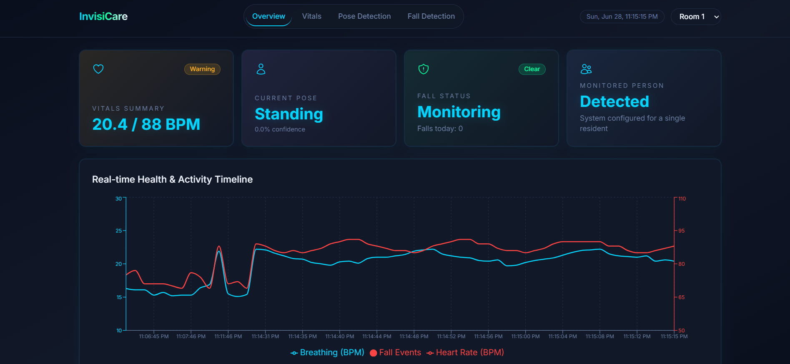
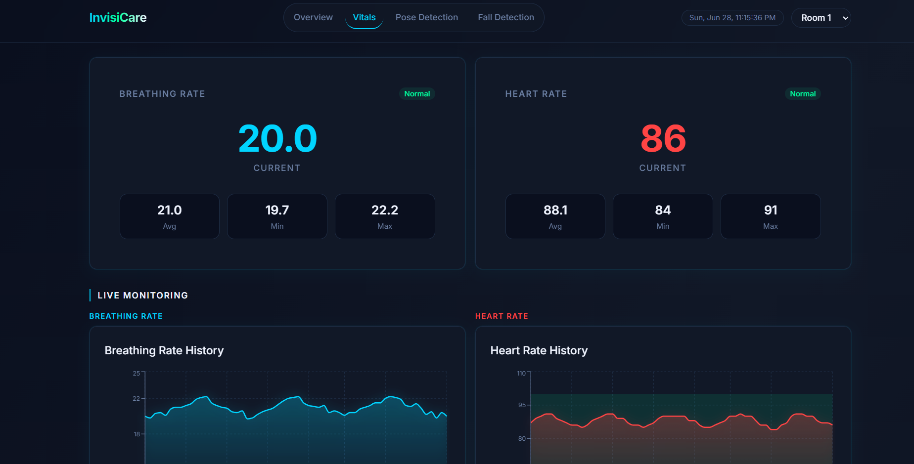
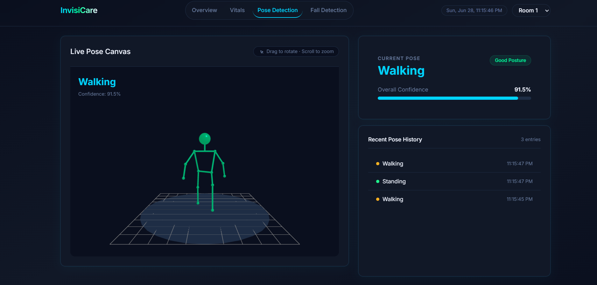
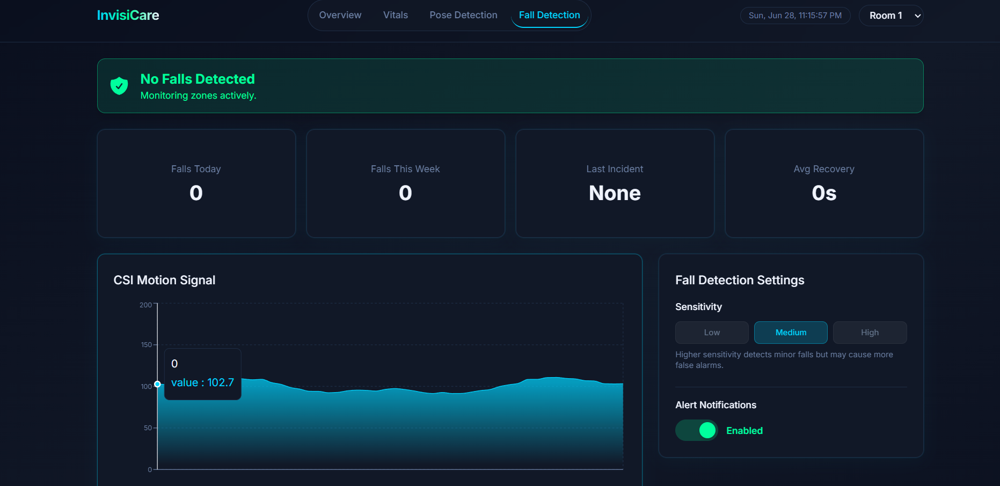

# InvisiCare — WiFi Health Monitor
Contactless, real-time health monitoring using WiFi CSI signals — tracking vitals, body pose, and fall detection without wearables or cameras.

---

## Screenshots


### Overview


### Vitals


### Pose Detection


### Fall Detection


---

## Features

- **Vital Signs** — Contactless breathing rate and heart rate monitoring via CSI bandpass filtering
- **Pose Detection** — Real-time 3D skeleton visualization with 17-keypoint body tracking
- **Fall Detection** — Automated fall alerts with event logging and caregiver notifications
- **Multi-Room Support** — Switch between monitored rooms from the dashboard header
- **Edge Processing** — All inference runs on-device with no cloud dependency

---

## Tech Stack

**Hardware**
- ESP32-S3

**Frontend**
- Next.js, Tailwind CSS, Zustand, Recharts, Three.js

**Backend**
- FastAPI, Python, PostgreSQL

**AI / Signal Processing**
- Rust, RuVector, PyTorch, Hugging Face

**Communication**
- WebSocket, MQTT

**DevOps**
- Docker, PyO3

---

## Getting Started

### Prerequisites
- Node.js 18+
- Python 3.10+
- Docker (optional)
- ESP32-S3 hardware node (optional — mock data available)

### Installation

```bash
# Clone the repository
git clone https://github.com/sumoseye/InvisiCare.git
cd InvisiCare

# Install frontend dependencies
cd dashboard
npm install

# Install backend dependencies
pip install -r requirements.txt
```

### Running the Dashboard

```bash
# Start the backend
uvicorn main:app --reload --port 8000

# Start the frontend
cd dashboard
npm run dev
```

Open [http://localhost:3000](http://localhost:3000) in your browser.

### Running with Docker

```bash
docker compose up
```

### Running without Hardware (Mock Mode)

The dashboard runs with simulated data when no ESP32 node is connected. Mock data is enabled by default when the hardware API is unreachable.

---

## System Architecture

```
ESP32-S3 Node
     │
     ▼ (MQTT / WebSocket)
Sensing Server (FastAPI)
     │
     ├── PostgreSQL (historical data)
     │
     ▼
API Routes (/api/vitals, /api/waveform, /api/pose, /api/falls)
     │
     ▼
Next.js Dashboard
     ├── Overview Tab
     ├── Vitals Tab
     ├── Pose Detection Tab
     └── Fall Detection Tab
```

---

## How It Works

1. An ESP32-S3 node captures Channel State Information (CSI) from ambient WiFi signals across 56 subcarriers
2. Raw CSI is processed through a Rust-based signal pipeline to extract breathing rate, heart rate, and motion features
3. A pretrained AI model maps the cleaned features to vital signs, 17-keypoint body pose, and fall events
4. Processed data is served via FastAPI and visualized in real time on the Next.js dashboard

---

## Project Structure

```
InvisiCare/
├── dashboard/          # Next.js frontend
│   ├── components/     # UI components
│   ├── lib/            # Stores, utils, constants
│   └── app/            # App router pages
├── firmware/           # ESP32-S3 firmware
├── python/             # Signal processing pipeline
├── docker/             # Docker configuration
└── docs/               # Documentation
```

---
